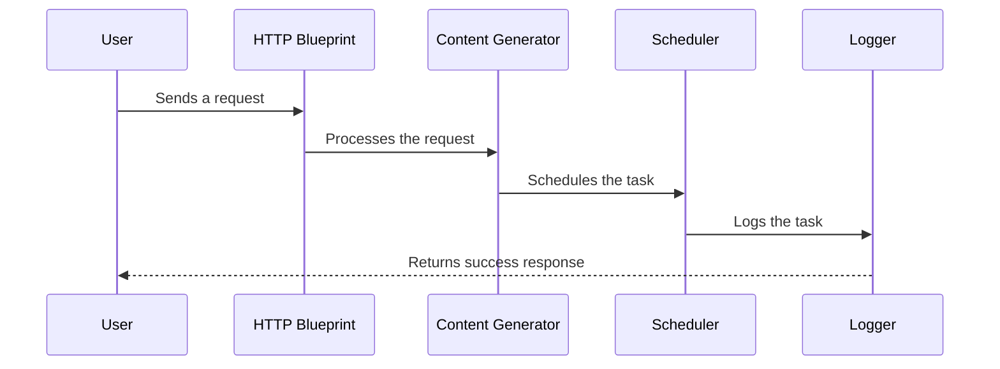

# Content Generator Function App

This repository contains a Function App designed to generate content for social media platforms. The app is built using Azure Functions and follows best practices for scalability and maintainability.

## Features

- **Content Generation**: Automatically generates content based on templates and user inputs.
- **Rate Limiting**: Ensures API calls are throttled to prevent overuse.
- **Logging**: Provides detailed logs for monitoring and debugging.
- **Scheduler**: Allows scheduling of content generation tasks.

## Folder Structure

```plaintext
content-generator/
├── __blobstorage__/         # Local blob storage for Azurite
├── __queuestorage__/        # Local queue storage for Azurite
├── blueprints/             # Flask blueprints for HTTP and scheduler endpoints
├── content_generation/     # Core logic for content generation
├── shared/                 # Shared utilities like logging and rate limiting
├── specs/                  # OpenAPI specifications
├── tests/                  # Unit tests
└── requirements.txt        # Python dependencies
```

## How It Works

### Sequence Diagram



### Components

1. **HTTP Blueprint**: Handles incoming HTTP requests and routes them to the appropriate service.
2. **Content Generator**: Core logic for generating content based on templates and user inputs.
3. **Scheduler**: Manages task scheduling and execution.
4. **Logger**: Provides logging functionality for monitoring and debugging.

## Setup

1. Install dependencies:
   ```bash
   pip install -r requirements.txt
   ```

2. Start the Azurite emulator:
   ```bash
   azurite
   ```

3. Run the Function App locally:
   ```bash
   func start
   ```

## Testing

Run unit tests using pytest:
```bash
pytest
```

## Deployment

Follow Azure best practices for deploying Function Apps. Ensure all environment variables are configured in `local.settings.json` or Azure App Settings.