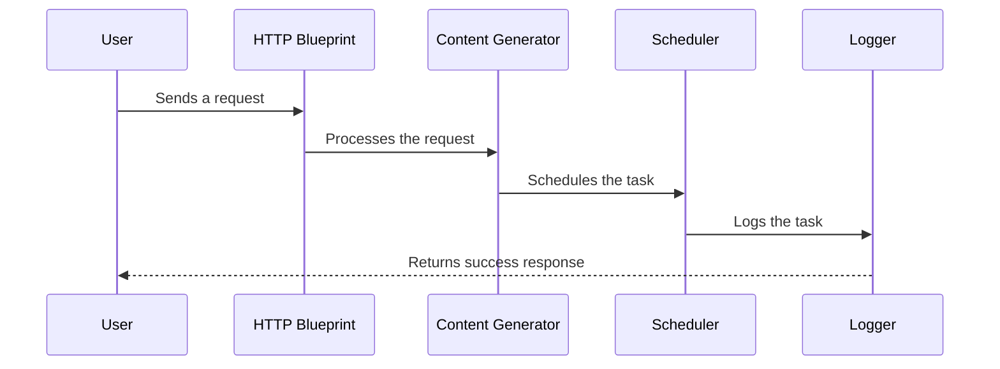

# Content Generator Function App

This repository provides a backend service for automated, scalable, and scheduled content generation for social media platforms. Built with Azure Functions, it is designed for extensibility, API-first development, and robust operational practices.

## Project Scope & Purpose

- **Automated Content Generation**: Generate social media content using templates, user inputs, and scheduling logic.
- **API-First Design**: OpenAPI specifications (`specs/`) define endpoints for integration with other services or frontends.
- **Modular Architecture**: Organized with blueprints for HTTP, scheduling, image, posting, and text generation, making it easy to extend or adapt for new platforms or content types.
- **Scalability & Scheduling**: Uses Azure Functions' event-driven model and a scheduler to handle content creation at scale and on a schedule.
- **Operational Excellence**: Includes rate limiting, detailed logging, and robust testing for reliability and maintainability.

## Key Use Cases

- Automate posting and content creation for brands or users across multiple social media platforms.
- Integrate with external tools or UIs via a documented API.
- Schedule content generation and posting tasks for future dates/times.
- Extend with new content types, platforms, or business logic by adding new blueprints or updating OpenAPI specs.

## Folder Structure

```plaintext
content-generator/
├── __blobstorage__/         # Local blob storage for Azurite
├── __queuestorage__/        # Local queue storage for Azurite
├── blueprints/              # Modular blueprints for HTTP, scheduler, image, posting, and text endpoints
├── content_generation/      # Core logic for content generation
├── shared/                  # Shared utilities (logging, rate limiting)
├── specs/                   # OpenAPI specifications for API-first development
├── tests/                   # Unit tests
└── requirements.txt         # Python dependencies
```

## Architecture Overview

- **Azure Functions**: Provides a scalable, event-driven backend for handling HTTP requests, scheduled jobs, and background processing.
- **Blueprints**: Modularize endpoints for different content and platform needs (HTTP, scheduler, image, posting, text).
- **OpenAPI Specs**: Ensure clear, versioned, and testable API contracts for integration.
- **Scheduler**: Enables automated, timed content generation and posting.
- **Logging & Rate Limiting**: Ensures observability and protects against abuse.

## How It Works

### Sequence Diagram



### Components

1. **HTTP Blueprint**: Handles incoming HTTP requests and routes them to the appropriate service.
2. **Content Generator**: Core logic for generating content based on templates and user inputs.
3. **Scheduler**: Manages task scheduling and execution.
4. **Logger**: Provides logging functionality for monitoring and debugging.

## Setup

1. Install dependencies:
   ```bash
   pip install -r requirements.txt
   ```
2. Start the Azurite emulator:
   ```bash
   azurite
   ```
3. Run the Function App locally:
   ```bash
   func start
   ```

## Testing

Run unit tests using pytest:
```bash
pytest
```

## Deployment

Follow Azure best practices for deploying Function Apps. Ensure all environment variables are configured in `local.settings.json` or Azure App Settings.

**Note:** Do not include the `.venv` directory in your deployment. Azure Functions will install dependencies from `requirements.txt` automatically during deployment.